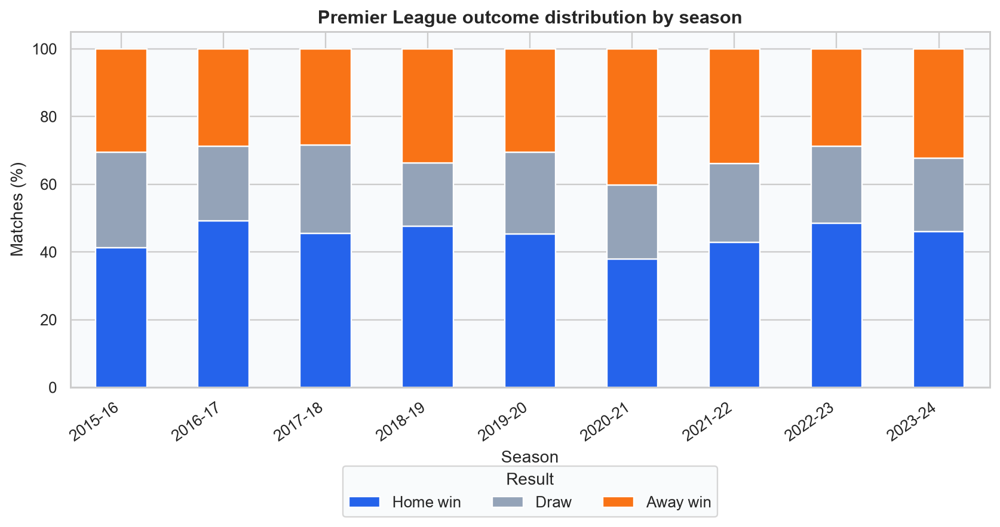
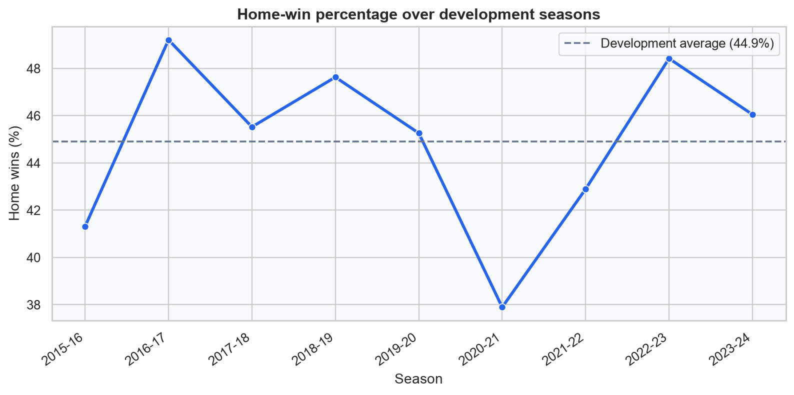
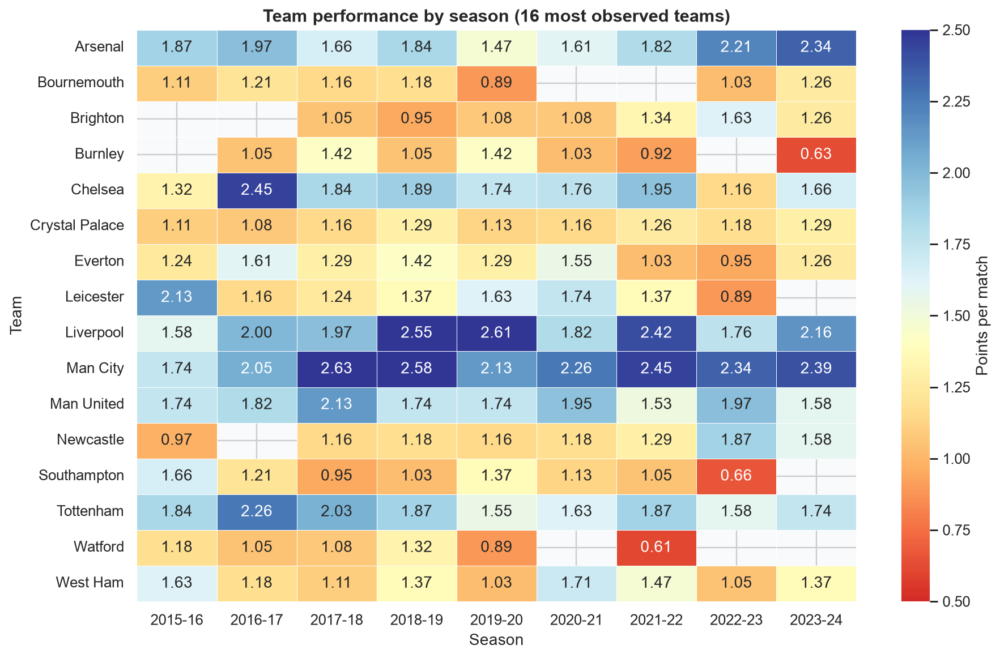
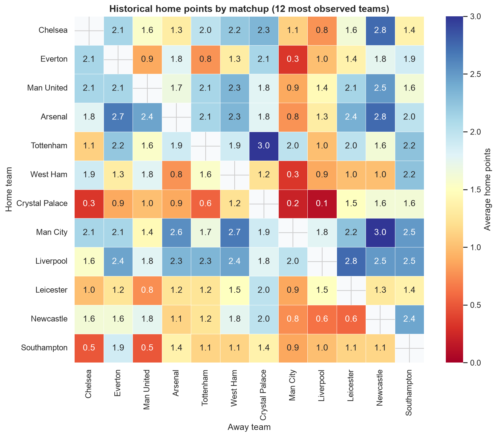
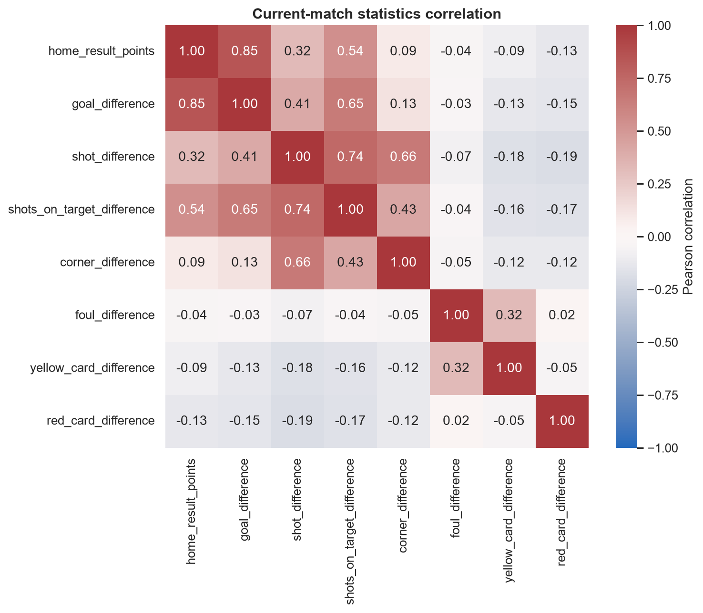
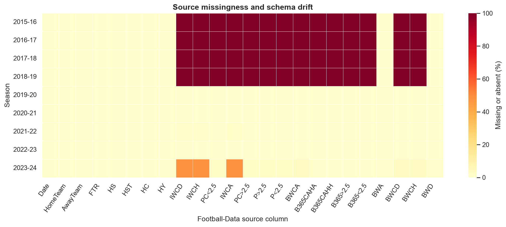
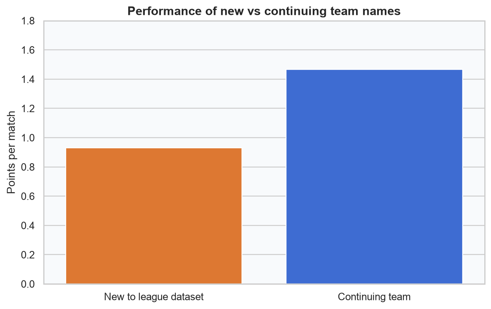

# FootCast Phase 2: Exploratory Analysis

## Scope and evaluation guard

This report uses 3420 validated matches from
2015-16 through 2023-24.
Only training and validation seasons are explored. The 2024-25 test season and
2025-26 holdout remain excluded from all Phase 2 calculations and figures.

No chart is a model evaluation, and no model or predictive feature is created.

## Main descriptive findings

- Home wins account for 44.91% of development matches,
  draws 23.19%, and away wins
  31.90%.
- Home-win frequency ranges from 37.89% in
  2020-21 to 49.21% in
  2016-17. The development-season average is
  44.91%.
- Man City has the highest overall points-per-match value in this
  development window (2.287). This is descriptive
  historical performance, not proof of future strength.
- Teams newly appearing relative to the prior season average
  0.931 points per match versus
  1.468 for continuing teams.
  "New" is a dataset-derived promotion/relegation candidate label, not an
  independently verified league-status field.
- Among non-goal current-match quantities, `shots_on_target_difference` has the
  largest absolute Pearson correlation with home-result points
  (0.543). Correlation does
  not establish causation or make the variable safe before kickoff.

## Figure interpretation guide

### Outcome distribution by season



- **Question:** How does the home/draw/away balance vary by season?
- **Available before kickoff?** No. Each outcome is known only after the match.
- **Use:** Exploratory and useful for later class-balance decisions.
- **Do not conclude:** A past seasonal rate is a probability for a future
  individual fixture.

### Home-win percentage over time



- **Question:** Has aggregate home advantage been stable?
- **Available before kickoff?** Historical rates are available; the current
  match result is not.
- **Use:** Exploratory. A lagged historical rate could be proposed and tested in
  Phase 3, but this same-season full rate cannot be used directly.
- **Do not conclude:** Changes are caused by one factor or will continue.

### Team-by-season performance heatmap



- **Question:** Which frequently observed teams accumulated the most points per
  match in each season?
- **Available before kickoff?** Completed-match history is available; final
  season aggregates are not available during that season.
- **Use:** Exploratory. Phase 3 may create shifted, date-specific equivalents.
- **Do not conclude:** Retrospective season strength is a leakage-safe feature.

### Home-team versus away-team history



- **Question:** How have the most frequently observed team pairings differed
  when one side played at home?
- **Available before kickoff?** Only results completed before a future kickoff.
- **Use:** Exploratory; the matrix shown uses the complete development window.
- **Do not conclude:** Sparse head-to-head averages are stable or causal.

### Numerical correlation heatmap



- **Question:** Which current-match numerical differences move together?
- **Available before kickoff?** No. Goals, shots, corners, fouls, and cards in
  the current match are post-kickoff information.
- **Use:** Descriptive only. Phase 3 may use shifted histories of these fields.
- **Do not conclude:** Correlation implies causation or predictive availability.

### Missing-value and schema-drift heatmap



- **Question:** Which stable and representative optional source columns are
  absent or incomplete across seasons?
- **Available before kickoff?** This is dataset metadata, not a match feature.
- **Use:** Guides later column selection and missing-data handling.
- **Do not conclude:** A missing optional bookmaker field invalidates the
  canonical match row.

### New-team comparison



- **Question:** Do teams newly appearing in the league dataset perform
  differently from continuing teams?
- **Available before kickoff?** Promotion status is generally known pre-season,
  but this label is inferred only from adjacent dataset team lists.
- **Use:** Exploratory until an explicit, verified promotion-status source or
  rule is approved.
- **Do not conclude:** The observed gap is caused by promotion alone.

## Reproduction

```bash
python -m footcast.exploration
```

The command revalidates the selected raw seasons, regenerates all figures, and
writes this report plus `reports/exploration_summary.json`.
